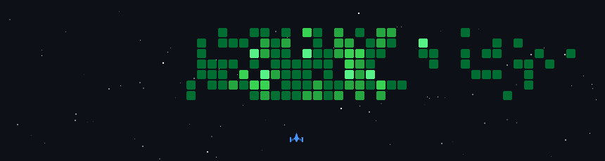

  

<h1 align="center">Hi 👋, I'm Umair Ejaz</h1>

<h3 align="center">AI/ML Engineer · LLM & RAG Developer · Computer Vision Engineer</h3>

  Building intelligent systems from embedded hardware to production AI.

  
  
  

  

---

## 👨‍💻 About Me

I'm an **AI/ML Engineer** focused on building practical, production-ready intelligent systems.

- 🤖 LLM agents, RAG systems, AI automation, and multi-agent workflows
- 👁️ Computer vision, medical imaging, and document forensics
- ⚙️ Embedded AI, control systems, signal processing, and edge ML
- ☁️ Backend engineering, Docker, cloud deployment, and CI/CD
- 🔬 Interpretable machine learning and evolutionary learning systems

I currently work as an **AI Engineer at Kutraa**, building and deploying multi-tenant AI-agent and automation products.

I'm also completing an **MPhil in Computer and Information Sciences at Auckland University of Technology**, researching interpretable and computationally efficient skin-lesion classification.

---

## 🚀 Featured Work

### 🧠 AI Bookkeeping Agent & Multi-Tenant Platform
**n8n · LangChain · Claude · Supabase · Nextcloud · Next.js**

Production AI bookkeeping assistant with document extraction, structured financial workflows, duplicate detection, receipt-to-invoice reconciliation, validation safeguards, and human confirmation before ledger updates.

### 🛡️ IDGuard Forensics
**FastAPI · YOLOv8 · EasyOCR · OpenCV · React · TypeScript · Docker**

AI-powered document-forensics platform for detecting manipulated or suspicious identity documents using vision models, OCR, structural checks, scoring pipelines, and trust-based analysis.

### 🧠 FundsXP AI
**OpenAI · Supabase · React · Node.js · Python · Celery · Docker**

Citation-grounded RAG assistant for private capital and secondaries knowledge with configurable retrieval, financial equation rendering, report export, secure API proxying, and automated testing.

### 🦾 RL-Tuned Hand-Tremor Stabilization Wearable
**ESP32 · MPU9250 · BLDC · PPO · PID · Arduino**

Embedded wearable system designed to reduce hand tremors in the 4–12 Hz range using real-time sensing, gyroscopic counter-torque, and reinforcement-learning-assisted PID tuning.

---

## 🔬 Current Research

### Interpretable Skin-Lesion Classification

My MPhil research explores a hybrid framework combining:

- Lightweight Vision Transformers
- Evolutionary Learning Classifier Systems
- Interpretable Boolean code fragments
- Explainable IF–THEN rules
- Handcrafted image descriptors
- Feature and classifier transfer
- CPU/mobile-friendly inference

The goal is an interpretable, efficient, and robust framework for melanoma and skin-lesion classification using datasets such as **ISIC** and **HAM10000**.

---

## 🛠️ Tech Stack

  

**AI & ML:** PyTorch, TensorFlow, Scikit-learn, Transformers, Vision Transformers, YOLOv8, OpenCV, MediaPipe, ONNX, Hugging Face

**LLMs & Agents:** LangChain, LangGraph, RAG, agentic workflows, embeddings, vector search, RAGAS, MCP, OpenAI API, Claude API, n8n

**Backend & Data:** FastAPI, Node.js, PostgreSQL, Supabase, Redis, Celery, REST, WebSockets, pgvector

**Embedded & Engineering:** STM32, ESP32, Arduino, PCB design, motor control, IMU/sensor fusion, MATLAB, signal processing, PID, reinforcement learning

**Cloud & DevOps:** Docker, Kubernetes, GitHub Actions, CI/CD, AWS, Azure, Hetzner, Coolify, RunPod, Linux

---

## 💼 Experience Snapshot

- **AI Engineer — Kutraa**: production LLM agents, automation systems, multi-tenant infrastructure, analytics, and deployment
- **Freelance AI Engineer — Upwork**: AI software, RAG, automation, computer vision, and generative AI projects
- **UAS & Payloads Design Engineer — NASTP**: DVB-S2/S2X simulation, LDPC chains, navigation, IMU fusion, Kalman filtering
- **Mitacs Globalink Research Intern — Toronto Metropolitan University**: embedded motor control, PCB design, haptics, and low-latency hardware systems

---

## 🎓 Education

**MPhil in Computer and Information Sciences**  
Auckland University of Technology, New Zealand · 2026–2027

**Bachelor of Electrical Engineering**  
National University of Sciences and Technology, Pakistan · 2021–2025

---

## 📊 GitHub Analytics

  
  

  

---

## 📈 Contribution Activity

  

---

## 🤝 Open to Collaboration

I'm interested in collaborating on **production AI systems, RAG and agentic applications, computer vision, medical imaging, embedded AI, intelligent automation, and interpretable machine learning**.

  

<b>⚡ Building Intelligent Systems from Embedded Hardware to Production AI ⚡</b>

